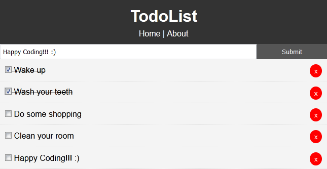

<p align="center"></p>

<h1 align="center">
    <strong>Angular TodoList</strong>
</h1>
<h3 align="center">
    TodoList app written in Angular
</h3>

<p align="left"></p>

## Angular
Angular https://angular.io/

Angular is full featured JavaScript framework created & maintained by Google and is used for building front-end applications or the front-end part of a full stack application.

AngularJS was released in 2010. It is not recommended and should be updated to Angular.

Angular refers to version 2+. Right now we are on version 7 but 2-7 is the same framework with a few changes, mostly under the hood.

## Angular gives you
* *Organized front-end structure (Components, Modules, Services)*
* *Extremely powerful & full featured*
* *All-in-one solution (Routing, HTTP, RxJS, etc)*
* *Build powerful SPA apps*
* *MVC - Model, View, Controller design pattern*
* *TypeScript*
* *Fantastic CLI*

## Installing Angular CLI
To check npm version
```
npm --version
```

Install Angular cli
```
npm install -g @angular/cli
```

Add path to your system:\
Control Panel > System > Advanced System Settings > Environment Variables > User Variables > PATH
```
C:\Users\ <USERNAME> \AppData\Roaming\npm
C:\Users\ <USERNAME> \AppData\Roaming\npm\node_modules\@angular\cli\bin
```

To check ng version
```
ng --version
```

## Creating Angular project
On terminal write
```
ng new angular-crash-todolist
```

On routing answer 'Yes'\
After that project folder will be created\

Change to project folder:
```
cd angular-crash-todolist
```

Open current project with VSCode:
```
code .
```

Start 'DEV' server that ng provides.
```
ng serve --open
```

This will open our prjoect's boiler plate on browser

## Project files
**packace.json**          - it has all depencencies and packages that are included\
**angular.json**          - config file, where you can import bootstrap or local files\
**src/index.html**        - main page\
**src/styles.css**        - styling\
**app/**                  - folder where you create all your components services\
**app/module.ts**         - entrypoint to Angular. All new components has to go there(cli will add automatically). All components will be TypeScript(.ts) files\
**app/app.component.ts**  - has TypeScript decorator. It includes metadata for component. 'app-root' will be displayed on index.html\
**app/app.component.html**- will be displayed inside index.html

## Project
Let's create new component 'Todos'
```
ng generate component components/Todos
```

This will create src/app/components/todos folder with:
* *todos.component.css*\
* *todos.component.html*\
* *todos.component.spec.ts*\
* *todos.component.ts*

On app.component.html we will embed our Todos page by adding component selector(app-todos)
```
<div>
  <app-todos></app-todos>
</div>
```

We'll add 'src/app/models/Todo.ts' file
```
export class Todo {
    id:number;
    title:string;
    completed:boolean;
}
```

And we import it to 'todos.components.ts'
```
import { Todo } from '../../models/Todo';
```

On ngOnInit we will add 3 todos
```
  ngOnInit(): void {
    this.todos = [
      {
        id: 1,
        title: 'Todo One',
        completed: false
      },
      {
        id: 2,
        title: 'Todo Two',
        completed: true
      },
      {
        id: 3,
        title: 'Todo Three',
        completed: false
      }
    ]
  }
```

If you get error 'Property 'id' has no initializer and is not definitely assigned in the constructor.'\
It is because TypeScript 2.7 includes a strict class checking where all the properties should be initialized in the constructor. A workaround is to add the ! as a postfix to the variable name:
```
export class Todo {
    id!:number;
    title!:string;
    completed!:boolean;
}
```

Let's loop thru this array on our 'todos.component.html' with 'ngFor'
```
<ul *ngFor="let todo of todos">
    <li>{{ todo.title }}</li>
</ul>
```

Output will display our todos
* Todo One\
* Todo Two\
* Todo Three\

Let's make every todo a different componenet.}
For that we type on our terminal
```
ng g c components/TodoItem
```

To display different component instead of list item we will use our\
created 'todo-item-component.ts' where selector will be 'app-todo-item'.\
So we change our code
```
<app-todo-item *ngFor="let todo of todos" [todo]="todo">
</app-todo-item>
```

This will give us 'todo' property error\
For that we need to define our property as input in 'todo-item-components'\
by adding input and defining an variable
```
import { Component, OnInit, Input } from '@angular/core';
import { Todo } from 'src/app/models/Todo';

@Component({
  selector: 'app-todo-item',
  templateUrl: './todo-item.component.html',
  styleUrls: ['./todo-item.component.css']
})
export class TodoItemComponent implements OnInit {
  @Input() todo!: Todo;

  constructor() { }

  ngOnInit(): void {
  }
}
```

Now our page will display\
todo-item works!\
todo-item works!\
todo-item works!

To show our items on page in 'todo-item-component.html' instead of
```
todo-item works!
```
We pass our values
```
<p>{{ todo.title }}</p>
```

Page will display\
Todo One\
Todo Two\
Todo Three

We will add a base 'styles.css' styling
```
*{
    box-sizing: border-box;
    margin: 0;
    padding: 0;
}

body{
    font-family: Arial, Helvetica, sans-serif;
    line-height: 1.4;
}

a{
    color: #333;
    text-decoration: none;
}

.container{
    padding: 0 1rem;
}

.btn{
    display: inline-block;
    border: none;
    background: #555;
    color: #555;
    padding: 7px 20px;
    cursor: pointer;
}

.btn:hover{
    background: #666;
}
```

We will add a checkbox and 'Delete' button to every todo
```
<div>
    <p>
        <input type="checkbox">
        {{ todo.title }}
        <button class="del">x</button>
    </p>
</div>
```

We will add styling for it in 'todo-item.component.css'
```
.del {
    background: #ff0000;
    color: #fff;
    border: none;
    padding: 5px 9px;
    border-radius: 50%;
    cursor: pointer;
    float: right;
}

.todo {
    background: #f4f4f4;
    padding: 10px;
    border-bottom: 1px #ccc dotted;
}

.is-complete {
    text-decoration: line-through;
}
```

We'll use ng class directiv to tell if todo is completed or not
```
<div [ngClass]="setClasses()">
```

In 'todo-item.component.ts' we will create 'setClasses()'
```
  setClasses() {
    let classes = {
      todo: true,
      'is-complete': this.todo.completed
    }

    return classes;
  }
```

We will add an event to input for 'checkbox' and 'Delete' button
```
<input (change)="onToggle(todo)" type="checkbox">
{{ todo.title }}
<button (click)="onDelete(todo)" class="del">x</button>
```

And we create those classes
```
onToggle(todo:any) {
todo.completed = !todo.completed;
}

onDelete(todo:any) {
console.log('delete');
}
```

On terminal we create services
```
ng g s services/Todo
```

We'll move our array from 'todos.component.ts' to 'todo.service.ts'
```
import { Injectable } from '@angular/core';

@Injectable({
  providedIn: 'root'
})
export class TodoService {

  constructor() { }

  getTodos() {
    return [
      {
        id: 1,
        title: 'Todo One',
        completed: true
      },
      {
        id: 2,
        title: 'Todo Two',
        completed: true
      },
      {
        id: 3,
        title: 'Todo Three',
        completed: false
      }
    ]
  }
}
```

And we call service in 'todos.component.ts'
```
import { Component, OnInit } from '@angular/core';
import { TodoService } from '../../services/todo.service';

import { Todo } from '../../models/Todo';

@Component({
  selector: 'app-todos',
  templateUrl: './todos.component.html',
  styleUrls: ['./todos.component.css']
})
export class TodosComponent implements OnInit {
  todos: Todo[] = [];

  constructor(private todoService:TodoService) { }

  ngOnInit(): void {
    this.todos = this.todoService.getTodos();
  }
}
```

We'll use JSON placeholder to store our inputs\
In 'app.modules.ts' we import 'HttpClientModule'
```
import { HttpClientModule } from '@angular/common/http';
HttpClientModule
```

In 'todo.service.ts' we also import that module, inject it into constructor and clear 'getTodos'
```
import { Injectable } from '@angular/core';
import { HttpClient, HttpHeaders } from '@angular/common/http';

import { Todo } from '../models/Todo';
import { Observable } from 'rxjs';

@Injectable({
  providedIn: 'root'
})
export class TodoService {
  todosUrl:string = 'https://jsonplaceholder.typicode.com/todos';

  constructor(private http:HttpClient) { }

  getTodos():Observable<Todo[]> {
    return this.http.get<Todo[]>(this.todosUrl);
  }
}
```

We'll change 'ngOnInit' in 'todos.component.ts'
```
ngOnInit(): void {
    this.todoService.getTodos().subscribe(todos => this.todos = todos);
}
```

Now we get about 200 todos from service.\
To limit that number to 5. We have can set it in todos URL
```
todosUrl:string = 'https://jsonplaceholder.typicode.com/todos?_limit=5';
```

Better way is to create whole new property for limit and set it in get request
```
export class TodoService {
  todosUrl:string = 'https://jsonplaceholder.typicode.com/todos?';
  todosLimit = '?_limit=5';

  constructor(private http:HttpClient) { }

  getTodos():Observable<Todo[]> {
    return this.http.get<Todo[]>(`${this.todosUrl}${this.todosLimit}`);
  }
}
```

In 'todo-item.components.ts' we import service, inject it and addit to 'onToggle' method
```
import { TodoService } from '../../services/todo.service'

constructor(private todoService:TodoService) { }

onToggle(todo:any) {
// Toggle in UI
todo.completed = !todo.completed;
// Toggle on server
this.todoService.toggleCompleted(todo).subscribe(todo => console.log(todo));
}
```

In 'todo.service.ts' we create object 'httpOptions' and method 'toggleCompleted'
```
const httpOptions = {
  headers: new HttpHeaders({
    'Content-Type': 'application/json'
  })
}

// Toggle Completed
toggleCompleted(todo: Todo):Observable<any> {
const url = `${this.todosUrl}/${todo.id}`
return this.http.put(url, todo, httpOptions);
}
```

Now when we click on checkbox our todo get strike thru and we see response on service on console

Next we handle the 'Delete' button.\
For that we will import 'EventEmitter' and 'Output' in 'todo-item.components.ts'\
create output and method
```
import { Component, OnInit, Input, EventEmitter, Output } from '@angular/core';

@Output() deleteTodo: EventEmitter<Todo> = new EventEmitter();

onDelete(todo:any) {
  this.deleteTodo.emit(todo);
}
```

We are going to catch this 'deleteTodo' in 'todos.component.html'
```
<app-todo-item 
    *ngFor="let todo of todos" 
    [todo]="todo"
    (deleteTodo)="deleteTodo($event)"
    >
</app-todo-item>
```

In 'todos.component.ts' we will create deleteTodo()
```
deleteTodo(todo:Todo){
  this.todos = this.todos.filter(t => t.id !== todo.id);
}
```

If we click now on delete button, todo will dissapear from UI.\
To access server side we'll add to 'todos.components.ts'
```
deleteTodo(todo:Todo){
  this.todos = this.todos.filter(t => t.id !== todo.id);
  this.todoService.deleteTodo(todo).subscribe();
}
```

Now we need to create deleteTodo service in 'todo.service.ts'
```
deleteTodo(todo: Todo):Observable<Todo>{
  const url = `${this.todosUrl}/${todo.id}`
  return this.http.delete<Todo>(url, httpOptions);
}
```

Next we'll add header component without any functionality. For that we write in terminal
```
ng g c components/layout/Header
```

Let's open up newly created './src/app/components/layout/header/header.component.html' and add an header tag
```
<header class="header">
    <h1>TodoList</h1>
</header>
```

In 'header.component.css' we add some styling
```
.header{
    background: #333;
    color: #fff;
    text-align: center;
    padding: 10px;
}

.header a {
    color: #fff;
    text-decoration: none;
}
```

Lets bring that header up to the main html 'app.component.html'.
```
<div>
  <app-header></app-header>
  <app-todos></app-todos>
</div>
```

Next we'll create component AddTodo in terminal
```
ng g c components/AddTodo
```

We will open up './src/app/components/add-todo/add-todo.component.ts' and add title property
```
import { Component, OnInit } from '@angular/core';

@Component({
  selector: 'app-add-todo',
  templateUrl: './add-todo.component.html',
  styleUrls: ['./add-todo.component.css']
})
export class AddTodoComponent implements OnInit {
  title!:string;

  constructor() { }

  ngOnInit(): void {
  }

}
```

In 'add-todo.component.html' we create form
```
<form class="form">
    <input type="text" name="title" [(ngModel)]="title" placeholder="Add Todo...">
    <input type="submit" value="Submit" class="btn">
</form>
```

In 'app.modules.ts' we'll import forms and add it to imports
```
import { FormsModule } from '@angular/forms'

imports: [
  BrowserModule,
  AppRoutingModule,
  HttpClientModule,
  FormsModule
],
```

We will embed addTodo in 'todos.component.html'
```
<app-add-todo></app-add-todo>
```

And we add some styling in 'add-todos.component.css'
```
.form{
    display: flex;
}

.form input[type='text']{
    flex: 10;
    padding: 5px;
}

.form input[type='submit']{
    flex: 2;
}
```

Next we add our todo to list in 'add-todo.component.html'
```
<form class="form" (ngSubmit)="onSubmit()">
```

In 'add-todo.component.ts' 
```
import { Component, OnInit, EventEmitter, Output } from '@angular/core';

@Component({
  selector: 'app-add-todo',
  templateUrl: './add-todo.component.html',
  styleUrls: ['./add-todo.component.css']
})
export class AddTodoComponent implements OnInit {
  @Output() addTodo: EventEmitter<any> = new EventEmitter();

  title!:string;

  constructor() { }

  ngOnInit(): void {
  }

  onSubmit(){
    const todo = {
      title: this.title,
      completed: false
    }

    this.addTodo.emit(todo);
  }

}
```

We'll catch it in our 'todos-component.html'
```
<app-add-todo (addTodo)="addTodo($event)"></app-add-todo>
```

In 'todos.component.ts'
```
addTodo(todo:Todo){
  this.todoService.addTodo(todo).subscribe(todo => {
    this.todos.push(todo);
  })
}
```

And in 'todo.service.ts' we will add addtodo
```
// Add Todo
addTodo(todo:Todo):Observable<Todo>{
 return this.http.post<Todo>(this.todosUrl, todo, httpOptions);
}
```

Now we can add our todos to the list on main page.\
Last thing to do is to use router in 'app-routing.module.ts'
```
import { TodosComponent } from './components/todos/todos.component';

const routes: Routes = [
  { 
    path: '', 
    component: TodosComponent
  }
];
```

In order to our router to work we have to go to our 'app.component.html' and change 'app-todos'
```
<div>
  <app-header></app-header>
  <router-outlet></router-outlet>
</div>
```

Now we add page 'about' in terminal
```
ng g c components/pages/About
```

In 'about.component.html'
```
<div>
    <h1>About</h1>
    <p>This is the TodoList app v1.0.0 It is part of a Angular crash course</p>
</div>
```

In routing module 'app-routing.module.ts'
```
import { NgModule } from '@angular/core';
import { RouterModule, Routes } from '@angular/router';
import { TodosComponent } from './components/todos/todos.component';
import { AboutComponent } from './components/pages/about/about.component';

const routes: Routes = [
  { path: '', component: TodosComponent },
  { path: 'about', component: AboutComponent }
];

@NgModule({
  imports: [RouterModule.forRoot(routes)],
  exports: [RouterModule]
})
export class AppRoutingModule { }
```

We can open About page addres in our browser
```
localhost:4200/about
```

We'll add a little navigation in the header 'header.component.html'
```
<header class="header">
    <h1>TodoList</h1>
    <nav>
        <a routerLink="/">Home</a> | <a routerLink="/about">About</a>
    </nav>
</header>
```

# Happy Coding !!!
